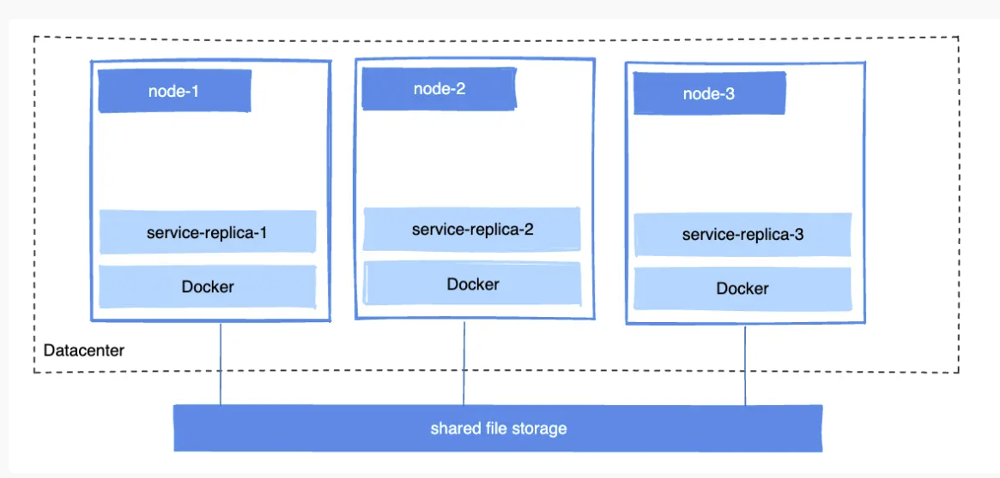

# Docker Storage
https://docs.docker.com/storage/

## 数据存储
`volumes / bind mounts / tmpfs`
持久化数据:首选volumes的方法；其次是bind mount方法.

**volumes**
创建docker volume存放的地址：`/var/lib/docker/volumes/`

**bind mount**
推荐`bind mount`方法的使用场景:
（1）`DNS config :  /etc/resolv.conf` 将每个容器的DNS配置mount到宿主机的配置
（2）源码共享或者构建artifiacts的时候，例如构建maven项目时, mount Maven项目的 `target/`路径到container里 
（3）container文件路径想要与host主机地址保持一致

`tmpfs`内存挂载:既不想存在宿主机，又不想放container。（存在的目的：写一大堆不想持久化的数据）


**（1）使用 volume 创建服务**
```shell
docker volume create <volume-name>
# 
docker volume create nginx-data
docker run -itd -p 8800:80 -v nginx-data:/usr/share/nginx/html nginx:v1
```
删除某个卷

```shell
docker volume rm <volume-name>
```
删除所有未使用的卷：
```shell
docker volume prune
```
列出所有卷：
```shell
docker volume ls
```
查看某个卷的信息：
```shell
docker volume inspect <volume-name>
```
挂载到容器：-v 或–volume。如果是 Docker17.06 或更高:推荐使用–mount。（同 bind mount）
挂载类型：key 为 type，value 为 bind、volume 或 tmpfs
挂载源：key 为 source 或 src，对于命名卷，value 为卷名，对于匿名卷，则忽略

**（2）使用 mount 创建服务**
`注意mount的时候 ， 前后不要有空格，否则语法错误`
```shell
docker service create \
 --mount 'type=volume,src=<VOLUME-NAME>,dst=<CONTAINER-PATH>,volume-driver=local,volume-opt=type=nfs,volume-opt=device=<nfs-server>:<nfs-path>,"volume-opt=o=addr=<nfs-address>,vers=4,soft,timeo=180,bg,tcp,rw"'
 --name myservice \
 <IMAGE>
```
`source / src`: 挂载源（可以为创建的volume名称）
`destination / dst / target`: 目标挂载地址

`--mount / -v` : 创建container
```shell
# 使用 --mount 命令挂载
 docker run -d --name devtest --mount source=myvol2,target=/app nginx:latest
# 使用 -v 命令挂载
 docker run -d --name devtest -v myvol2:/app nginx:latest
```
`注意：删除container的时候，相关挂载的volume不会自动连带删除，需要自己手动删除。`
注意：`docker service create` 挂载volume的时候只能使用 `--mount` 命令

**（2）使用 tmpfs 创建服务**

使用`--tmpfs`命令采用tmpfs内存挂载，或者使用`--mount type=tmpfs`的方式进行挂载，推荐使用更稳健的`--mount`命令
```shell
# mount参数方式
 docker run -d -it --name tmptest --mount type=tmpfs,destination=/app nginx:latest
# tmpfs参数方式
 docker run -d -it --name tmptest --tmpfs /app nginx:latest
```

`--tmpfs`: 无配置选项, 只能用于standalone的containers.
`--mount type=tmpfs,destination=/app`


## 数据共享

