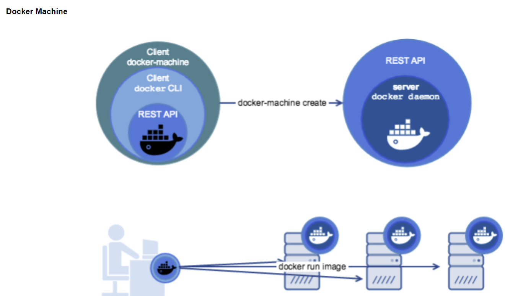
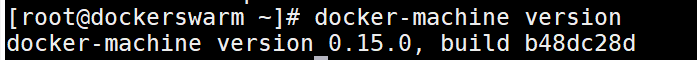
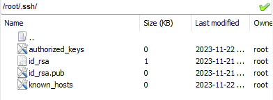
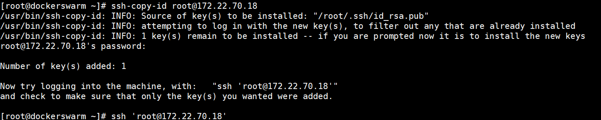
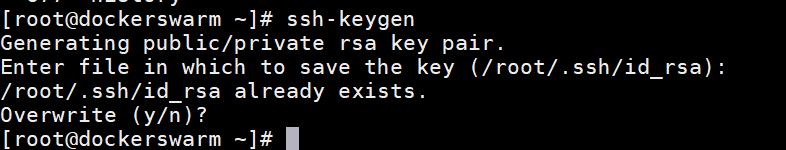
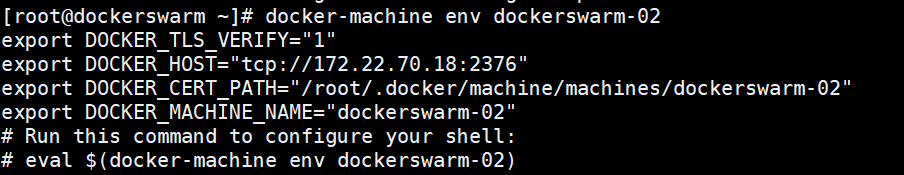
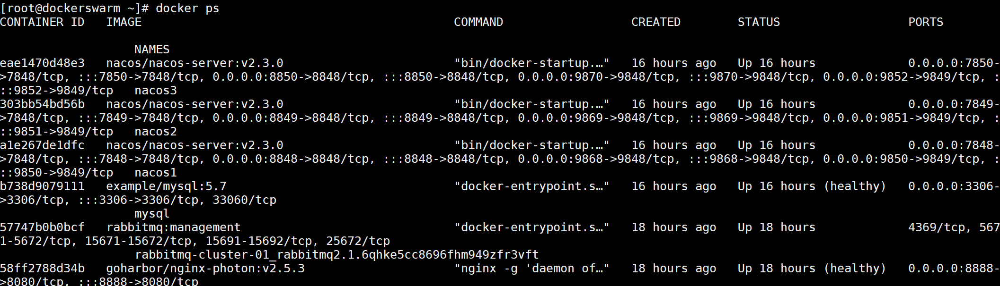

# Docker Machine 
https://zhuanlan.zhihu.com/p/358666246

Docker Machine可用于配置和管理您的Dockerized主机（主机上有Docker Engine）。

通常在本地系统上安装Docker Machine。Docker Machine有自己的命令行客户端docker-machine和Docker Engine客户端docker。您可以使用machine在一个或多个虚拟系统上安装Docker Engine。这些虚拟系统可以是本地的（如在Mac或Windows上使用machine在VirtualBox中安装和运行Docker Engine）或远程的（如在云提供商上使用machine安装和运行Docker Engine）。


## Linux安装(Centos7)
在终端执行下列命令：

```shell
$ base=http://mirrors.aliyun.com/docker-toolbox/linux/machine/0.15.0 &&
  curl -L $base/docker-machine-Linux-x86_64 >/tmp/docker-machine &&
  sudo mv /tmp/docker-machine /usr/local/bin/docker-machine &&
  chmod +x /usr/local/bin/docker-machine
```
检查是否安装成功
```shell
 docker-machine version
```


## SSH
### 生成宿主机ssh钥匙🔑
```shell
# 当前主机地址为 root@172.22.70.12 
ssh-keygen # 随后直接无脑回车 （以下显示结果）
```
```shell
[root@dockerswarm ~]# ssh-keygen
Generating public/private rsa key pair.
Enter file in which to save the key (/root/.ssh/id_rsa):
Created directory '/root/.ssh'.
Enter passphrase (empty for no passphrase):
Enter same passphrase again:
Your identification has been saved in /root/.ssh/id_rsa.
Your public key has been saved in /root/.ssh/id_rsa.pub.
The key fingerprint is:
SHA256:YCm7jwq5oDEq7XHDLMUqNNO6bAL+wfTgpJHeB+6s77c root@dockerswarm
The key's randomart image is:
+---[RSA 2048]----+
|                 |
|       .         |
|    . +          |
|  o. + .         |
| * *+   S        |
|+.&=+.           |
|X=+**o           |
|BO=+o=           |
|B=BBoEo          |
+----[SHA256]-----+
```
```shell
id_rsa.pub : 公钥
id_rsa ： 私钥
```


### SSH钥匙复制到目标主机
```shell
ssh-copy-id <用户名>@<目标主机ip地址>
# 可通过ip addr 查看 ens192
# 示例：当前主机地址172.22.70.12复制ssh钥匙到目标主机172.22.70.18
ssh-copy-id root@172.22.70.18 
```


### SSH登录目标主机
复制ssh key到目标主机成功后, 可通过ssh命令直接登入目标主机（172.22.70.18）：
```shell
ssh 'root@172.22.70.18'
```
## Docker Machine创建
### 直接创建
如果本机没有虚拟机，直接使用create方法创建docker machine

https://zhuanlan.zhihu.com/p/35102874

```shell
docker-machine create default --virtualbox-no-vtx-check
# 禁止vtx检查，避免出现 Error with pre-create check: "This computer doesn't have VT-X/AMD-v enabled. Enabling it in the BIOS is mandatory" 的错误
```

### 已存在添加
如果本机已经有虚拟机之后，直接使用create方法将目标docker添加到docker machine
https://blog.csdn.net/m0_46243410/article/details/107690124

```shell
# ssh key 生成方式：
ssh-keygen
# /root/.ssh/id_rsa
# 将ssh key copy 到目标主机
ssh-copy-id root@172.22.70.18
```


执行下面命令，将目标docker主机添加到docker machine宿主机
```shell
docker-machine create --driver generic --generic-ip-address=172.22.70.18 --generic-ssh-key ~/.ssh/id_rsa manager
# 注意目标主机一定要开启docker才行连接
```
在docker machine宿主机，可以看到添加的目标docker主机
```shell
docker-machine ls
```


## 管理操作目标Machine
进入目标机Docker环境
```shell
docker-machine env dockerswarm-02
```
提示执行以下命令配置环境
```shell
 eval $(docker-machine env dockerswarm-02)
```


执行完成后使用docker命令，即可操作目标主机的docker

