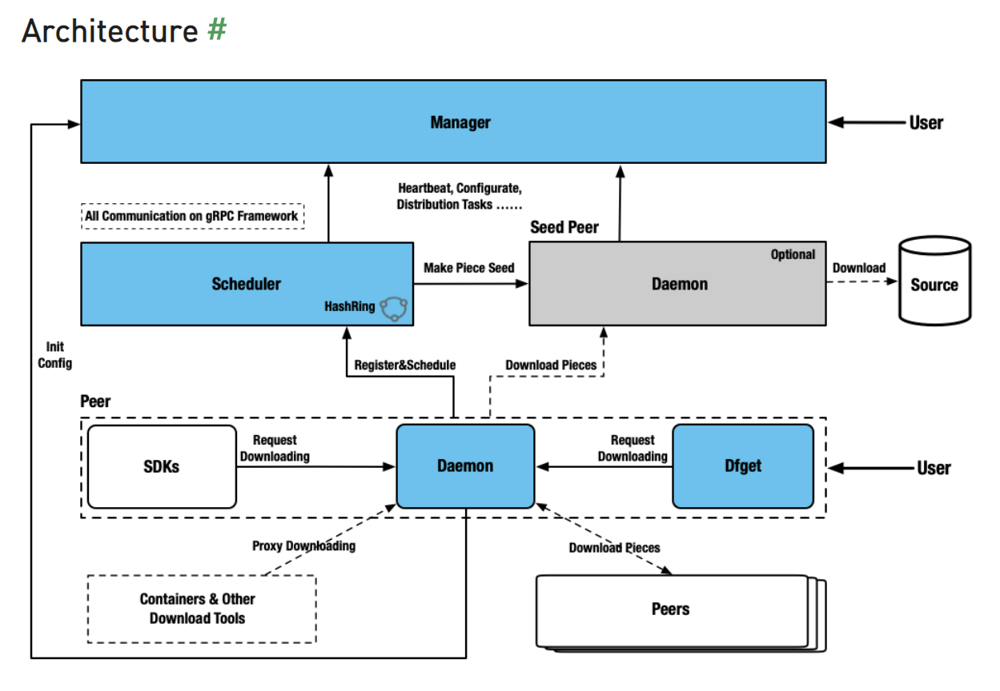

# DragonFly

Dragonfly是一个基于P2P的智能文件分发系统。解决了应用部署，大规模缓存文件分发，数据文件分发，图像分发等大规模文件分发场景中低效率，低成功率，浪费网络带宽等问题。在阿里巴巴，系统每月转移20亿次，分配3.4PB数据，成为阿里巴巴最重要的基础设施之一。可靠性高达99.9999％。

https://d7y.io/docs/next/#features

## DragonFly架构
https://d7y.io/docs/next/concepts/terminology/architecture/

## DragonFly 部署安装
https://www.jianshu.com/p/1a85ea6b53ee

https://zhuanlan.zhihu.com/p/149785661

https://d7y.io/docs/next/getting-started/quick-start/docker-compose/
