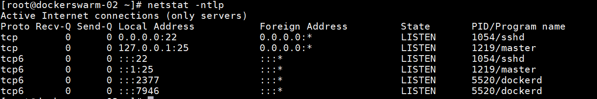
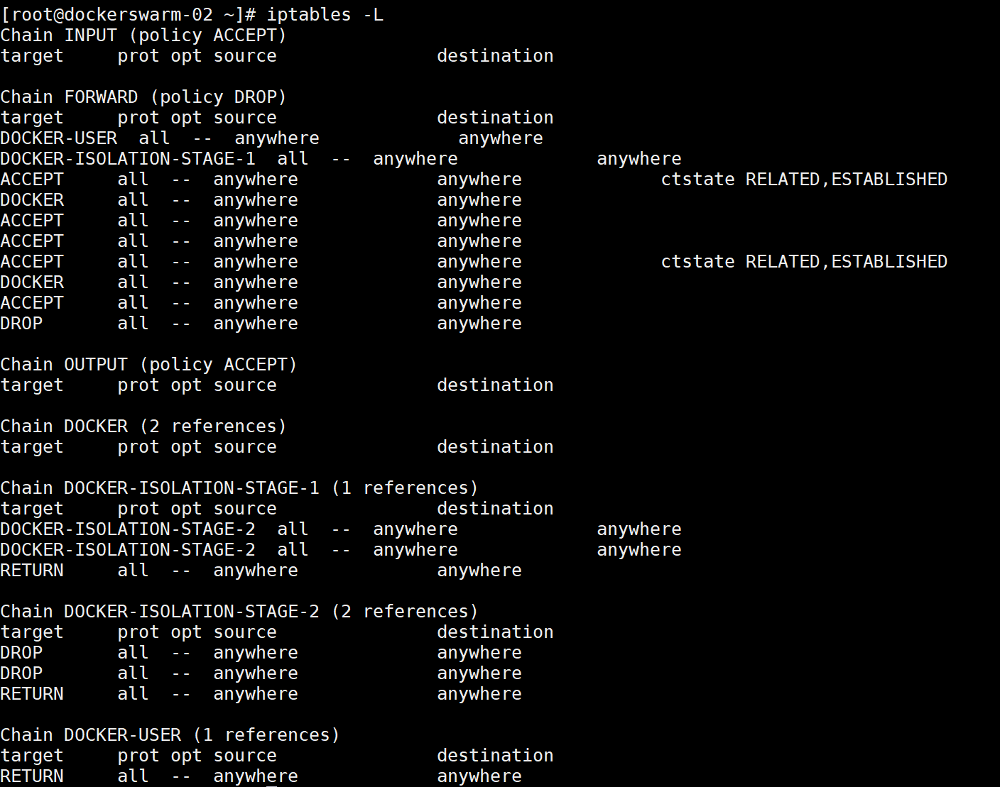

# Docker 网络

查看服务器所有端口
```shell
netstat -ntlp
```


查看NAT网络
```shell
sudo iptables -t nat -nL
```
**报文链路**
`input`: 处理数据包目标地址是本机的规则

`output`: 处理本机发送的数据包，即包源地址是本机的规则

`forward`: 匹配流经过本机的数据包

`prerouting`: 用来修改目标地址，用来做DNAT（网络地址转换）例：端口映射

`postrouting`: 用来修改源地址，用来做SNAT（源地址转换）例：内网通过路由器NAT实现内网多个PC公用一个公网IP地址进行上网。

**报文流向：**

到本机某进程的报文：`PREROUTING --> INPUT`

由本机转发的报文：`PREROUTING --> FORWARD --> POSTROUTING`

由本机的某进程发出报文（通常为响应报文）：`OUTPUT --> POSTROUTING`


**查看己设置iptables规则**
```shell
# 查看filter表的iptables规则
iptables -L
# 以数字形式显示规则
iptables -n -L
```
