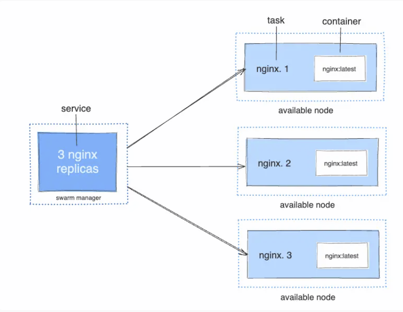
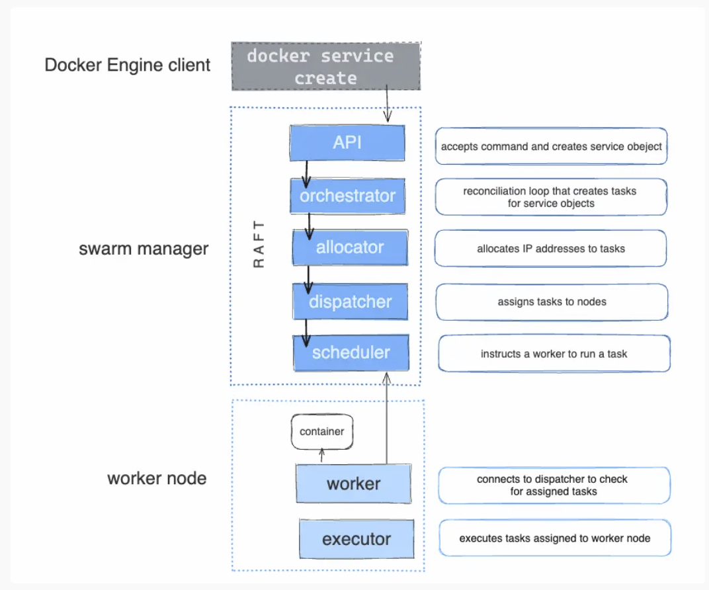
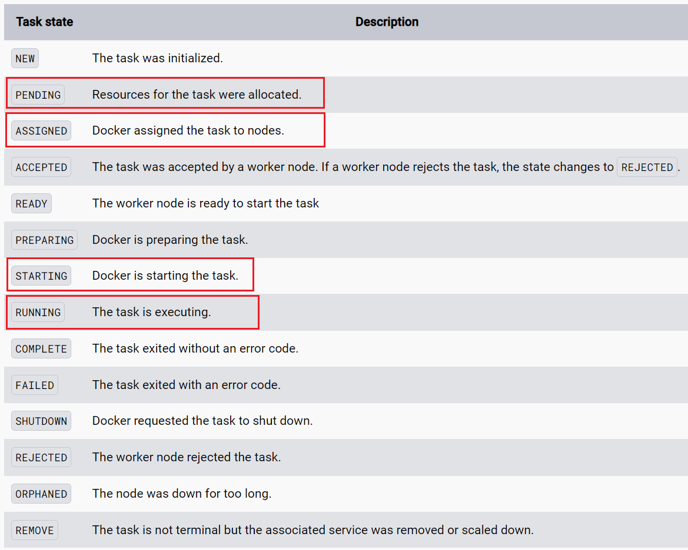
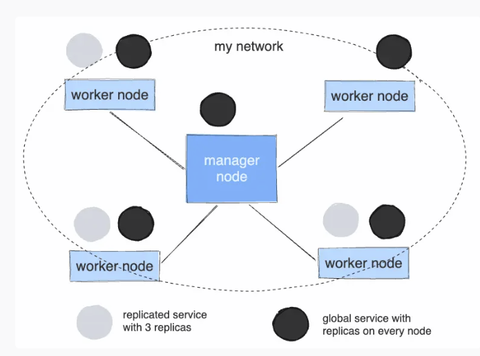
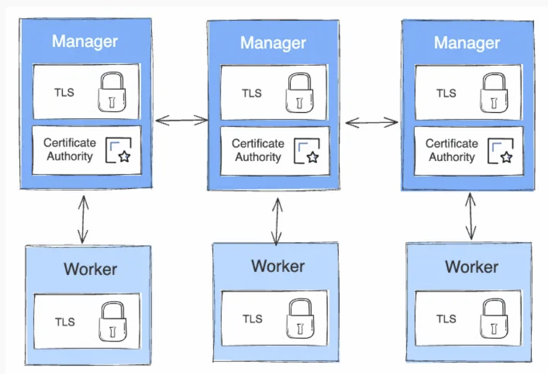

# Docker service
https://docs.docker.com/engine/swarm/how-swarm-mode-works/services/

## Gernel

**Create a service** 
```shell
docker service create <images>
docker service create --name my_web nginx
docker service create --name helloworld --env MYVAR=myvalue --workdir /tmp --user my_user alpine ping docker.com
docker service update --args "ping docker.com" helloworld
```
`service(1) => task(3) => container(3)`
`scheduler + orchestrator`
`The current version of Docker only supports container tasks.`




## Status


View task state
```shell
docker service ps <service-name>
 docker inspect <container>
```

## Replicated and global 

`replica` : you specify the number of identical tasks you want to run
`global` : a service that runs one task on every node



## Swarm mode public key infrastructure (PKI)
**Public key infrastructure (PKI)**
https://docs.docker.com/engine/swarm/how-swarm-mode-works/pki/
Transport Layer Security (TLS)

`Each time a new node joins the swarm, the manager issues a certificate to the node`

`certificate`: node ID = certificate common name (CN) + organizational unit (OU)



**Rotating the CA certificate**
generate a new CA certificate and key
```shell
docker swarm ca --rotate 
# all new node certificates issued are signed with the new root CA
```
