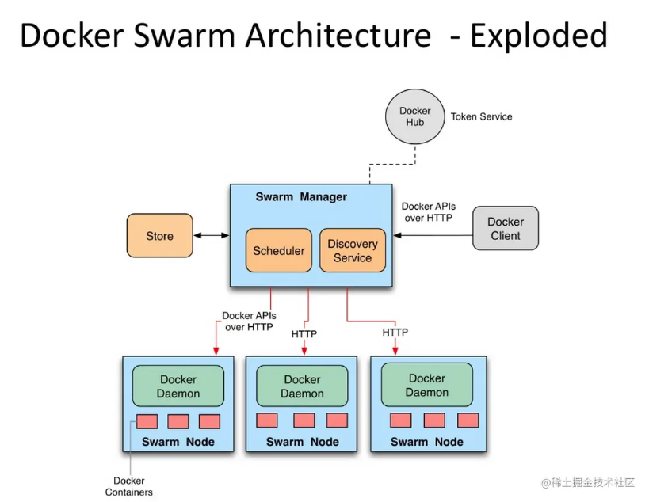

# Docker Swarm Architect
https://juejin.cn/post/6946421472499859487



---

# Docker Swarm Command
```shell
docker swarm init  //docker swarm init
docker swarm join-token worker //查看加入woker的命令。
docker swarm join-token manager //查看加入manager的命令
docker swarm join //加入集群
docker swarm leave  //退出集群
 
docker node ls //查看集群节点
docker node rm  //删除某个节点（-f强制删除）
docker node inspect //查看节点详情
docker node demote  //节点降级
docker node promote //节点升级
docker node update  //更新节点

docker service ls // 查看当前运行服务
docker service create --name testweb --replicas 3 -p 80:80 webapplication2:latest // 创建具有3个副本的web应用服务

# 服务管理
docker service
    # 创建一个服务
    - docker service create
          # 创建的副本数
          - docker service create --replicas 副本数
          # 指定容器名称
          - docker service create --name 名字
          # 每次容器与容器之间的更新时间间隔。
          - docker service create --update-delay s秒
          # 更新时同时并行更新数量，默认1
          - docker service create --update-parallelism 个数
          # 任务容器更新失败时的模式，（“pause”停止|”continue“继续），默认pause。
          - docker service create --update-failure-action 类型
          # 每次容器与容器之间的回滚时间间隔。
          - docker service create --rollback-monitor 20s
          # 回滚故障率如果小于百分比允许运行
          - docker service create --rollback-max-failure-ratio .数值（列“.2”为%20）
          # 添加网络
          - docker service create --network 网络名
          # 创建volume类型数据卷
          - docker service create --mount type=volume,src=volume名称,dst=容器目录
          # 创建bind读写目录挂载
          - docker service create --mount type=bind,src=宿主目录,dst=容器目录
          # 创建bind只读目录挂载
          - docker service create --mount type=bind,src=宿主目录,dst=容器目录,readonly
          # 创建dnsrr负载均衡模式
          - docker service create --endpoint-mode dnsrr 服务名
          # 创建docker配置文件到容器本地目录
          - docker service create --config source=docker配置文件,target=配置文件路径
          # 创建添加端口
          - docker service create --publish 暴露端口:容器端口 服务名
  # 查看服务详细信息，默认json格式
    - docker service inspect
          # 查看服务信息平铺形式
          - docker service inspect --pretty 服务名
    # 查看服务内输出
    - docker service logs
    # 列出服务
    - docker service ls
    # 列出服务任务信息
    - docker service ps　　　　
          # 查看服务启动信息
          - docker service ps 服务名
          # 过滤只运行的任务信息
          - docker service ps -f "desired-state=running" 服务名
    # 删除服务
    - docker service rm
    # 缩容扩容服务
    - docker service scale
          # 扩展服务容器副本数量
          - docker service scale 服务名=副本数
    # 更新服务相关配置
    - docker service update
          # 容器加入指令
          - docker service update --args “指令” 服务名
          # 更新服务容器版本
          - docker service update --image 更新版本 服务名         
         # 回滚服务容器版本
         - docker service update --rollback 回滚服务名
          # 添加容器网络
          - docker service update --network-add 网络名 服务名
          # 删除容器网络
          - docker service update --network-rm 网络名 服务名
          # 服务添加暴露端口
          - docker service update --publish-add 暴露端口:容器端口 服务名
          # 移除暴露端口
          - docker service update --publish-rm 暴露端口:容器端口 服务名
          # 修改负载均衡模式为dnsrr
          - docker service update --endpoint-mode dnsrr 服务名
          # 添加新的配置文件到容器内
          - docker service update --config-add 配置文件名称，target=/../容器内配置文件名 服务名
```

## 在创建docker swarm service的时候需要为其创造一个docker swarm network

```shell
# 创建docker swarm 服务网络
docker network create -d overlay smartbup-net
# 创建 docker swarm 服务时绑定网络
docker service create --name smartbup_swarm --network smartbup-net -p 7011:7011 --mode global 172.22.70.12:8888/dev/smartbup:latest
# 在所有node上创建swarm集群服务时，需要运行的节点上需要有对应的service镜像
```

