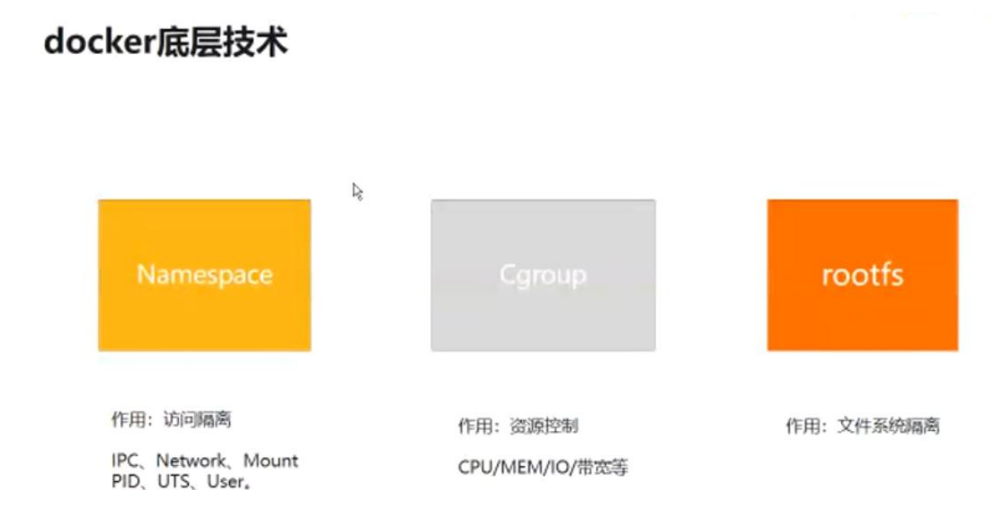

# Note
## Docker底层技术

`Namespace`: 访问隔离，Linux Namespaces 机制提供一种资源隔离方案。每个 Namespace 下的资源，对于其他 Namespace 下的资源都是不可见的。

`Cgroup` : 来资源控制，CPU\MEM\宽带等。提供的一种可以限制、记录、隔离进程组所使用的物理资源机制，实现进程资源控制。

`rootfs` : 文件系统隔离。