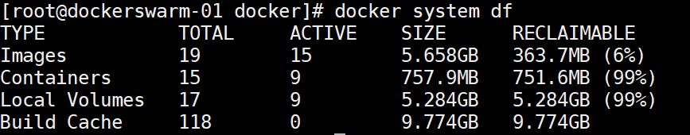

# 问题
## 磁盘容量情况查看
**查看指定目录下容量**
```shell
df -h /usr/
```
**查看当前目录每个文件夹的情况**
```shell
du --max-depth=1 -h 
```
**查看docker磁盘空间情况**
```shell
docker system df
```


**清理Build Cache缓存的命令**
```shell
docker builder prune
```
**清理磁盘，删除关闭的容器、无用的数据卷和网络，以及dangling镜像（即无tag的镜像）**
```shell
# 注意，这两个命令会把你暂时关闭的容器，
# 以及暂时没有用到的 Docker 镜像都删掉
# 请注意使用！
docker system prune
docker system prune -a # 清理得更加彻底
```

## 解决docker磁盘空间不足 && Docker的/var/lib/docker文件夹占满了磁盘空间
/root 一般不会挂载或者分配大的数据盘 && /opt 可以

`先清理不必要的镜像和日志，然后再迁移目录`

https://blog.csdn.net/qq_45473377/article/details/118889446

https://www.cnblogs.com/llfctt/p/13408857.html

查看 `/var/lib/docker/` 下使用的容量
```shell
 du -sh /var/lib/docker/
```

查看磁盘容量
```shell
df -h
```
删除无用镜像
```shell
# WARNING! 
# This will remove all images without at least one container associated to them.
docker image prune -a
```

选择磁盘容量大的空间，且在上面创建新的docker目录
```shell
mkdir -p /mydata/docker/lib
```
迁移/var/lib/docker目录下的文件到新创建的目录/docker/lib
```shell
rsync -avzP /var/lib/docker /mydata/docker/lib
```
删掉docker旧目录 `/var/lib/docker`
```shell
rm -rf /var/lib/docker
```

添加软连接将`/var/lib/`指向`/var/lib/`
```shell
ln -s /mydata/docker/lib /var/lib
```

编辑 /etc/docker/daemon.json 
```json
{
  "insecure-registries": ["172.20.220.12:8888","172.20.220.15:8888","172.20.220.18:8888"],
  "data-root": "/mydata/docker/lib"
}

```
添加
```json
{
  "data-root":"/docker/lib/docker"
}
```
重新加载docker并重启
```shell
systemctl daemon-reload
systemctl restart docker
```
检查docker root路径是否变更为新目录：/docker/lib/docker
```shell
docker info
```


# 卸载docker
**使用yum命令卸载docker**
```shell
yum remove docker-ce \
           docker-ce-cli \
           containerd
```
删除相关文件夹

