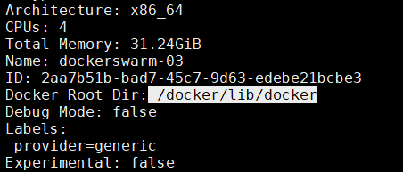

# 问题
## 解决docker磁盘空间不足 && Docker的/var/lib/docker文件夹占满了磁盘空间
/root 一般不会挂载或者分配大的数据盘 && /opt 可以

`先清理不必要的镜像和日志，然后再迁移目录`

https://blog.csdn.net/qq_45473377/article/details/118889446

https://www.cnblogs.com/llfctt/p/13408857.html

查看 `/var/lib/docker/` 下使用的容量
```shell
 du -sh /var/lib/docker/
```

查看磁盘容量
```shell
df -h
```
选择磁盘容量大的空间，且在上面创建新的docker目录
```shell
mkdir -p /docker/lib
```
迁移/var/lib/docker目录下的文件到新创建的目录/docker/lib
```shell
rsync -avz /var/lib/docker /docker/lib
```
编辑 /etc/docker/daemon.json 
```shell
{
  "data-root":"/docker/lib/docker"
}
```
重新加载docker并重启
```shell
systemctl daemon-reload
systemctl restart docker
```
检查docker root路径是否变更为新目录：/docker/lib/docker
```shell
docker info
```


删掉docker旧目录 `/var/lib/docker`
```shell
rm -rf /var/lib/docker
```

