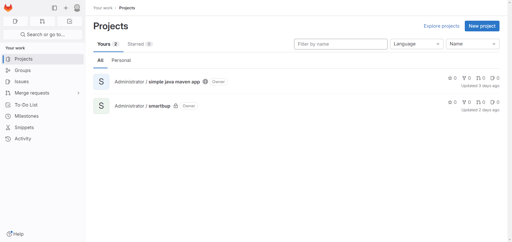

# Gitlab

如何使用gitlab：https://docs.gitlab.com/ee/user/
文档： https://docs.gitlab.com/
Gitlab CI/CD: https://docs.gitlab.com/ee/ci/

## 本地化部署（Docker）
（1）镜像拉取
```shell
# 查找Gitlab镜像
docker search gitlab
# 拉取Gitlab镜像
docker pull gitlab/gitlab-ce:latest
```
（2）创建gitlab容器
```shell
# 启动容器
docker run \
 -itd  \
 -p 9980:80 \
 -p 9922:22 \
 -v /var/lib/gitlab/etc:/etc/gitlab  \
 -v /var/lib/gitlab/log:/var/log/gitlab \
 -v /var/lib/gitlab/opt:/var/opt/gitlab \
 --restart always \
 --privileged=true \
 --name gitlab \
 gitlab/gitlab-ce:latest
```
（3）配置

`接下来的配置请在容器内进行修改，不要在挂载到宿主机的文件上进行修改。否则可能出现配置更新不到容器内，或者是不能即时更新到容器内，导致gitlab启动成功，但是无法访问`

```shell
# 进入gitlab容器内
docker exec -i gitlab /bin/bash
```
进入gitlab容器内的bash之后进行配置：
```shell
#修改gitlab.rb
vi /etc/gitlab/gitlab.rb
```
按下 **i** 键，在gitlab.rb文件中添加如下配置：
```shell
#gitlab访问地址。如果端口默认为80
external_url 'http://172.22.70.12'
#ssh主机ip
gitlab_rails['gitlab_ssh_host'] = 'http://172.22.70.12'
#ssh连接端口
gitlab_rails['gitlab_shell_ssh_port'] = 9922
```
然后按下 **wq!** 组合键，保存文件修改后退出，然后输入下面命令让配置生效：
```shell
gitlab-ctl reconfigure
```

`注意不要重启，/etc/gitlab/gitlab.rb文件的配置会映射到gitlab.yml这个文件，由于在docker中运行，gitlab生成的http地址应该是http://172.22.70.12:9980。所以，修改下面gitlab.yml文件(仍然在gitlab容器内部)`

```shell
# 修改http和ssh配置
vi /opt/gitlab/embedded/service/gitlab-rails/config/gitlab.yml

# 将文件中的改为9980
gitlab:
    host: 172.22.70.12
    port: 9980 
    https: false

#重启gitlab 
gitlab-ctl restart
#退出容器 
exit  
```
## Gitlab访问

按之前配置的host的地址与端口，访问 http://172.22.70.12:9980

`首次访问，直接出现登录界面不知道root的密码，可进行如下操作更改root密码`

```shell
# 进入容器内部
docker exec -it gitlab /bin/bash
```
```shell
# 进入控制台
gitlab-rails console -e production
# 查询id为1的用户，id为1的用户是超级管理员
user = User.where(id:1).first
# 修改密码为lhx123456
user.password='p@ssw0rd'
# 保存
user.save!
# 设置为true的时候，密码修改才算成功
# 退出控制台
exit
# 退出容器
exit
```




# 创建gitlab集群

创建gitlab集群volume存储地址：
sh gitlab-volume-creator.sh

创建gitlab集群网络
```shell
docker network create --scope=swarm --attachable -d overlay gitlab-network
```
将`gitlab.rb`，`root_password.txt` 以及 `git-stack.yml` 放在同一路径下，使用portainer stack （docker compose yml文件进行编排）部署
```shell
docker stack deploy -c gitlab-stack.yml gitlab
```