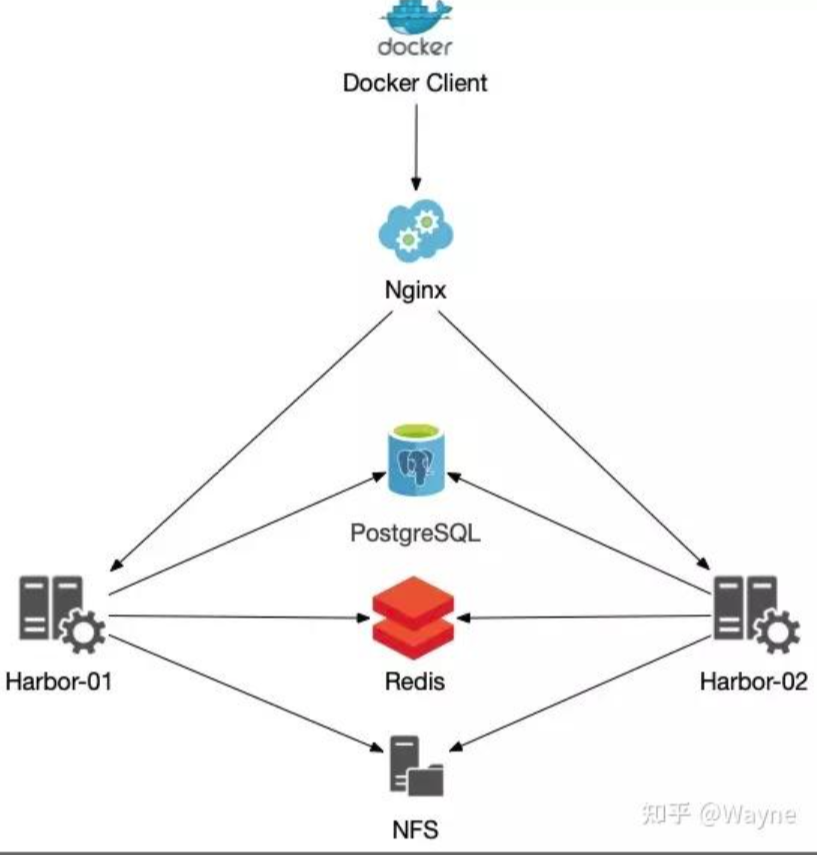
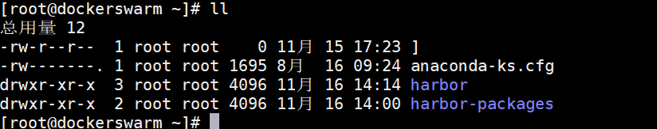
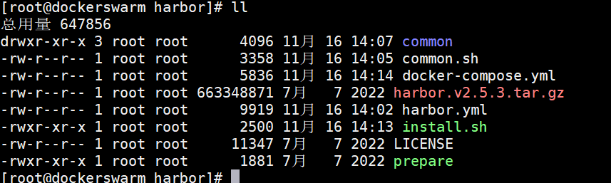
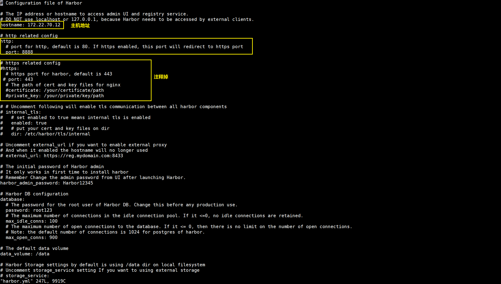
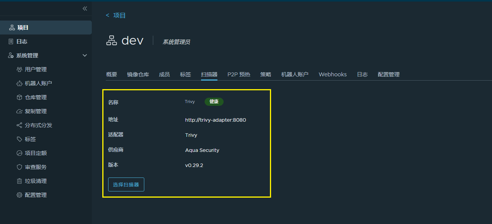
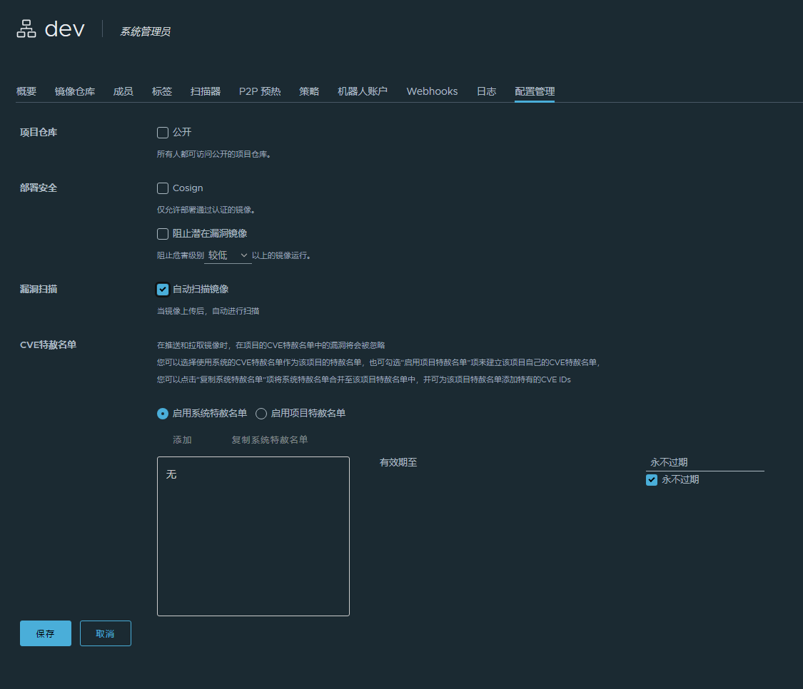
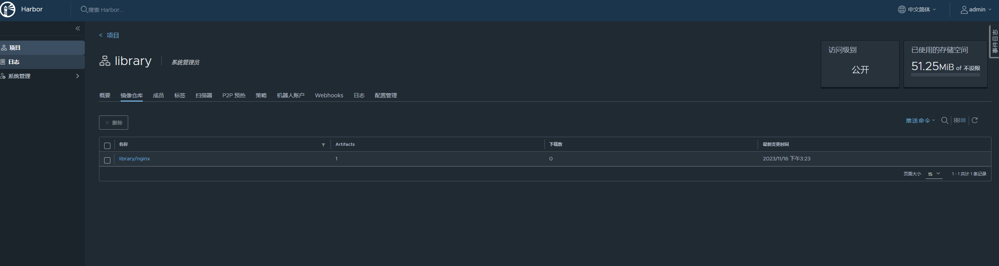
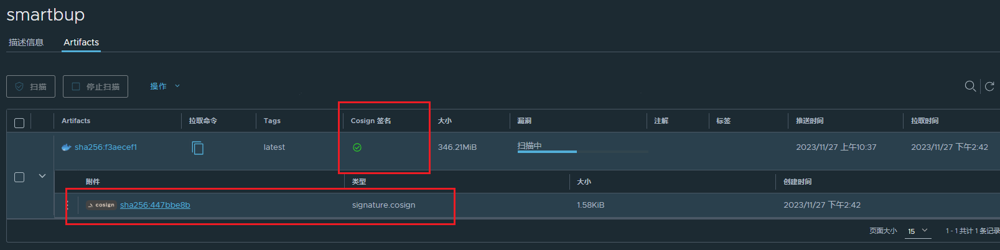

# Harbor

## Harbor架构


## 高可用架构：多实例共享后端存储



## 部署安装
https://www.cnblogs.com/netcore3/p/17513138.html

下载harbor包
```shell
# Github源
wget https://github.com/goharbor/harbor/releases/download/v2.9.1/harbor-offline-installer-v2.9.1.tgz
# 代理源(推荐使用)
wget https://ghproxy.com/https://github.com/goharbor/harbor/releases/download/v2.5.3/harbor-offline-installer-v2.5.3.tgz
```
解压harbor文件包
```shell
 # 解压harbor文件
 tar -zxvf harbor-offline-installer-v2.5.3.tgz
 # 移动到 ~/harbor
 mv harbor ~/harbor
```


修改harbor.yml配置文件
```shell
cd harbor
mv harbor.yml.tmpl harbor.yml
```


```shell
vi harbor.yml
```
修改主机地址，端口以及将https配置注释掉



启动 harbor
```shell
./install.sh
```
开启镜像扫描器(trivy)的启动方式：
```shell
# 开启trivy （默认安全扫描扫描器）
./install.sh --with-trivy
# 开启trivy 和 chartmuseum
./install.sh --with-trivy --with-chartmuseum
# 可选择其他镜像安全扫描器，默认为trivy
# Note: Please set hostname and other necessary attributes in harbor.yml first. DO NOT use localhost or 127.0.0.1 for hostname, because Harbor needs to be accessed by external clients.
# Please set --with-notary if needs enable Notary in Harbor, and set ui_url_protocol/ssl_cert/ssl_cert_key in harbor.yml bacause notary must run under https.
# Please set --with-trivy if needs enable Trivy in Harbor
# Please set --with-chartmuseum if needs enable Chartmuseum in Harbor
```

启动完成
登录：http://172.22.70.12:8888/


初始用户登录账号密码
```
username : admin
password : Harbor12345
```

开启了镜像安全扫描器的启动，可在项目中看到trivy镜像扫描器



可对镜像安全扫描进行配置




## 镜像推送
```shell
# docker标记镜像
docker tag SOURCE_IMAGE[:TAG] 172.22.70.12:8888/library/REPOSITORY[:TAG]
# push 镜像到 harbor仓库
docker push 172.22.70.12:8888/library/REPOSITORY[:TAG]
# 示例如下：
# 给要推送的镜像打tag
docker tag nginx:1.19 172.22.70.12:8888/library/nginx:1.19
# 登录远程harbor仓库
docker login 172.22.70.12:8888
# 推送镜像到harbor仓库
docker push 172.22.70.12:8888/library/nginx:1.19
```


自动对pushed的镜像进行漏洞扫描
- 前提：开启镜像安全扫描器


## 仓库复制

仓库管理 -> 添加目标 -> 目标仓库地址（ip + port）-> 访问ID（可用机器人账号访问/目标仓库指定用户账号）


复制管理界面->添加镜像复制规则 -> 资源过滤（dev/** : 项目dev下的所有资源） -> 目标仓库选择仓库管理配置的目标 -> 目标 （需要复制到目标仓库的项目名空间）-> 触发模式（什么机制下触发复制事件）


## 镜像签名(cosign)
### 签名过程
https://blog.gitguardian.com/supply-chain-security-sigstore-and-cosign-part-ii/#:~:text=Using%20Cosign%201%203.1%20Install%20The%20easiest%20way,this%3A%20...%203%203.3%20Signature%20and%20Verification%20


### Cosign

https://goharbor.io/blog/cosign-2.5.0/

#### 安装
https://edu.chainguard.dev/open-source/sigstore/cosign/how-to-install-cosign/

Installing Cosign with the Cosign Binary

```shell
# 下载安装包
wget "https://github.com/sigstore/cosign/releases/download/v2.0.0/cosign-linux-amd64" 
# 移动到local/bin
sudo mv cosign-linux-amd64 /usr/local/bin/cosign 
# 授予执行权限
sudo chmod +x /usr/local/bin/cosign
```
#### Cosign镜像签名
启动harbor仓库
```shell
# 进入harbor目录
cd ~/harbor
# 启动harbor
./install.sh --with-notary --with-trivy
# 也可以直接使用启动
./install.sh --with-trivy --with-chartmuseum
```
采用cosgin生成cosign.key
```shell
$ cosign generate-key-pair
>>> Enter password for private key:
>>> Enter again:
>>> Private key written to cosign.key
>>> Public key written to cosign.pub
```


以项目授权用户登录，并push打好标签的镜像，使用cosign进行镜像签名，sign的密码为之前生成cosign.key输入的密码

```shell
# 登录harbor仓库
$ docker login <ip>:<port>
# push镜像
 docker push <镜像tag>
 # cosign镜像
 cosign sign --key cosign.key <镜像tag>
>>> Enter password for private key:
>>> Pushing signature to: xxxx
```
可见镜像添加了signature.cosign签名附件



#### Cosign签名验证
验证签名镜像
```shell
 cosign verify --key cosign.pub <镜像tag> | jq .
 # 如果提示没有 jq 命令 json工具包 : 在centos下使用：
 yum -y install jq 
```
验证结果


## 镜像制品保留策略

参考文档：
https://goharbor.io/docs/1.10/working-with-projects/working-with-images/create-tag-retention-rules/

https://blog.csdn.net/q48S71bCzBeYLOu9T0n/article/details/117202971

Artifact保留策略的设置是以项目为单位的，并且以 Tag 作为 Artifact 的标识来判断是否需要保留，所以管理界面上显示的是“Tag保留规则”

该规则是一个包含仓库名称匹配、Artifact 条件和Tag 名称匹配的过滤器。Harbor 保留策略任务在执行过程中对每个 Artifact 都用保留规则匹配，如果Artifact 被任意一条规则匹配成功，即为需要保留的 Artifact，否则为待删除的 Artifact。

`保留制品的策略，以镜像仓库项目为单位，可手动单次进行保留策略的执行，也可按指定规则自动执行镜像制品配置的保留策略。`

`仓库项目 -> 策略 -> 添加规则（tag保留）-> 立即执行 / 定时执行`


# 问题解决
### [Step 1]: checking docker-compose is installed ...✖ Need to install docker-compose(1.18.0+) by yourself first and run this script again.

https://blog.csdn.net/webBOFB/article/details/129330055

docker新版语法问题
- 修改common.sh文件

```shell
vim common.sh 
```
`将改所有docker-compose --version 为 docker compose version`
`将所有包含docker-compose命令改为docker compose`

- 修改install.sh
```shell
vim ./install.sh
```
`将所有包含docker-compose命令改为docker compose`

### 报错提示：Error response from daemon: Get https://192.168.186.120/v1/users/: dial tcp 192.168.186.120:443: getsockopt: connection refused

参考文档： https://www.cnblogs.com/hahaha111122222/p/11799300.html

修改docker的daemon.json文件（如果没有就在/etc/docker/文件夹下新建daemon.json文件）
将需要访问的地址添加到"insecure-registries": ["https://172.22.70.12:8888"]

```shell
vim /etc/docker/daemon.json 
# 在daemon.json文件里添加如下代码
{
   "insecure-registries": ["https://172.22.70.12:8888"]
}
```
重载daemon文件 并 重启docker
```shell
systemctl daemon-reload 
systemctl restart docker
```


