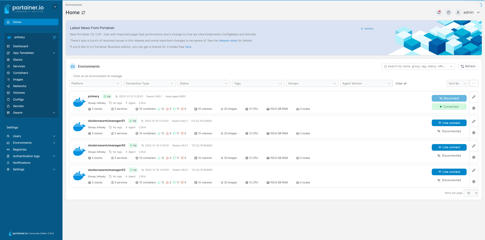

# Portainer

## 使用DockerSwarm部署Portainer CE（Linux）
https://docs.portainer.io/start/install-ce/server/swarm/linux


创建minio集群网络
```shell
docker network create --scope=swarm --attachable -d overlay portainer-agent-network
```

下载portainer stack yml文件
```shell
curl -L https://downloads.portainer.io/ce2-19/portainer-agent-stack.yml -o portainer-agent-stack.yml
```
`注意添加portainer agent 的端口号映射： 9001`

使用docker stack 和 portainer-agent-stack.yml 文件部署 （按需修改yml文件:）
`注意1：文件数据卷的映射`
`注意2：确保所有节点都有需要创建的镜像存在（目前不知道为什么使用stack部署时必须已经存在镜像才能创建成功，无法自动拉取镜像创建服务）`
```shell
docker stack deploy -c portainer-agent-stack.yml portainer
```


登入Portainer管理UI，添加Agent作为Swarm集群的统一EndPoint：





## 汉化版 Portainer 安装
使用汉化版的portainer镜像 `6053537/portainer-ce`
使用docker stack 与 `portainer-agent-stack.yml`文件 部署 portainer 集群：
```yml
version: '3.6'

networks:
  network1:
    name: portainer-agent-network
    external: true
  
services:
  agent:
      image: portainer/agent:2.19.4
      ports:
        - "9001:9001"
      volumes:
        - /var/run/docker.sock:/var/run/docker.sock
        - /mydata/docker/lib/volumes:/var/lib/docker/volumes
      networks:
        - network1
      
      deploy:
        mode: global
        placement:
          constraints: [node.platform.os == linux]

  portainer:
    image: 6053537/portainer-ce
    environment:
      - DMIN_USERNAME:"admin"
      - ADMIN_PASS:"1234567891011"
    command: -H tcp://tasks.agent:9001 --tlsskipverify
    ports:
      - "9443:9443"
      - "9000:9000"
      - "8000:8000"
    volumes:
      - /mydata/portainer/data:/data
      # - /mydata/portainer/public:/public
    networks:
      - network1
    deploy:
      mode: replicated
      replicas: 1
      placement:
        constraints: [node.role == manager]
```