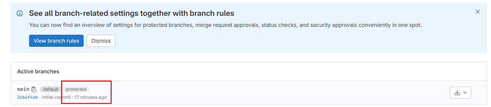
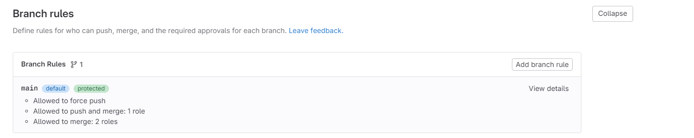
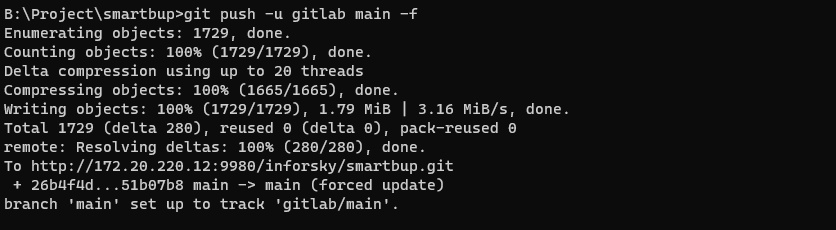

# push reject： not allowed to force push code to a protected branch on this project
设置gitlab的ssh key，添加本地访问机器的ssh密匙

暂时取消分支机构的保护。
Gitlab - Settings - Repository - Protected Branches - Unprotect
或者自己按需配置repo分支的push和merge规则

执行命令就可以push了, 本地repo配置的remote要一致
```shell
git push -u gitlab main -f
```
