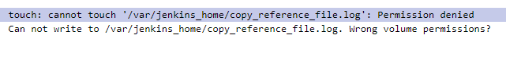
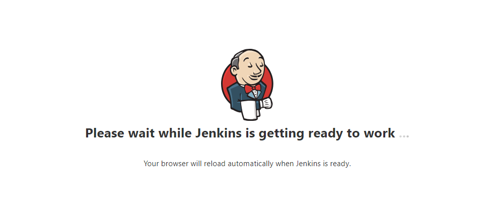

# jenkins集群启动问题：touch: cannot touch ‘/var/jenkins_home/copy_reference_file.log’: Permission denied


参考文档：https://blog.csdn.net/zpwangshisuifeng/article/details/108482248

给jenkins容器绑定的本地jenkins文件添加操作权限
```shell
chown -R 1000:1000 /mydata/jenkins
```

# jenkins在首次安装启动后一直卡着无法进入


修改jenkins挂载本地文件夹：
`/mydata/jenkins/home/hudson.model.UpdateCenter.xml`
使用镜像源
```xml
<?xml version='1.1' encoding='UTF-8'?>
<sites>
  <site>
    <id>default</id>
    <url>https://mirror.xmission.com/jenkins/updates/update-center.json</url>
  </site>
</sites>
```

# jenkins 插件下载失败
参考文档：https://blog.csdn.net/mahoon411/article/details/124178361