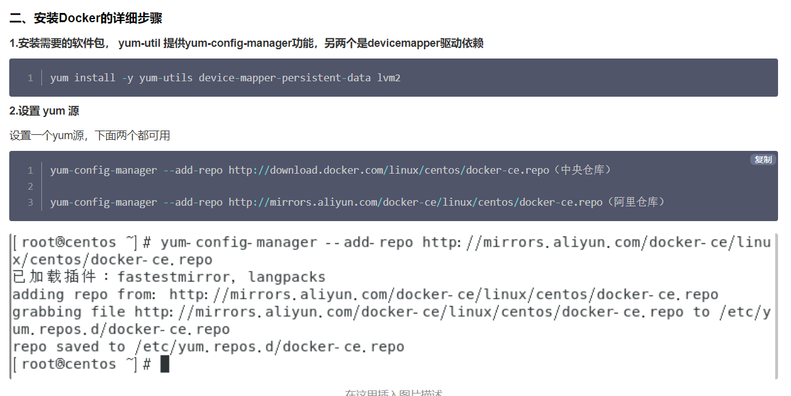
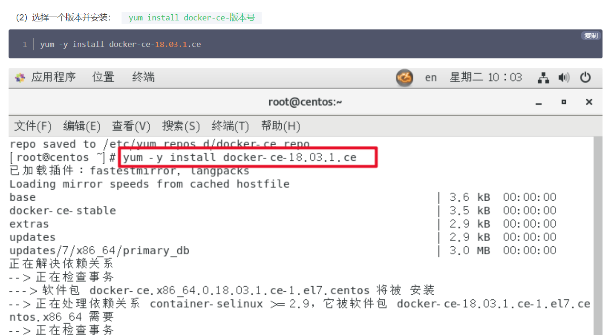
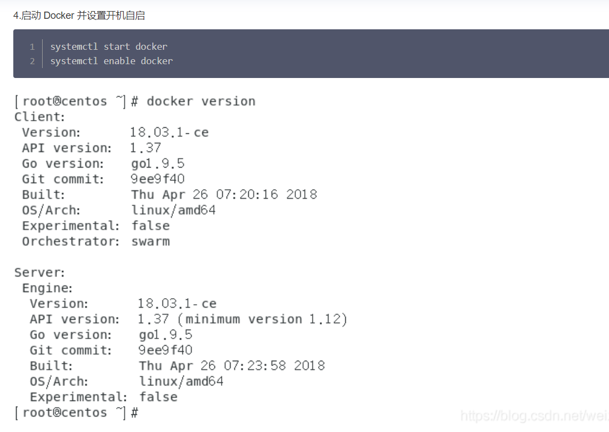
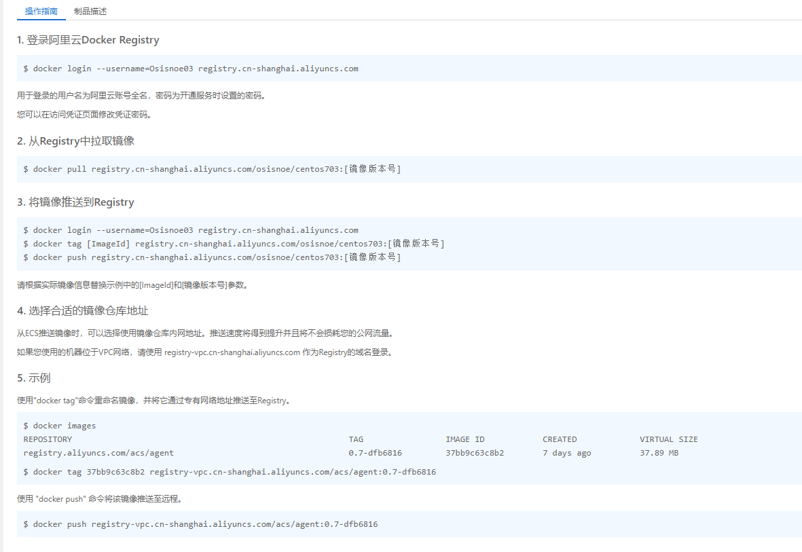
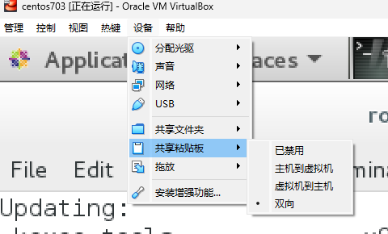
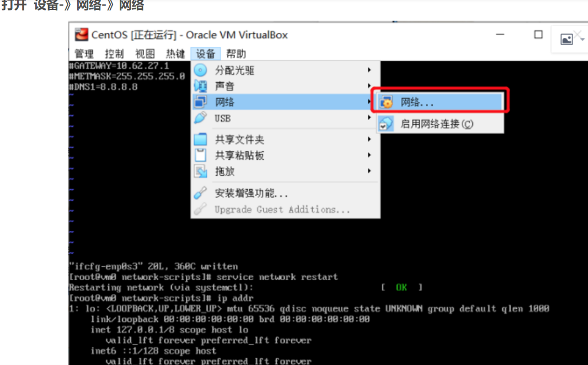
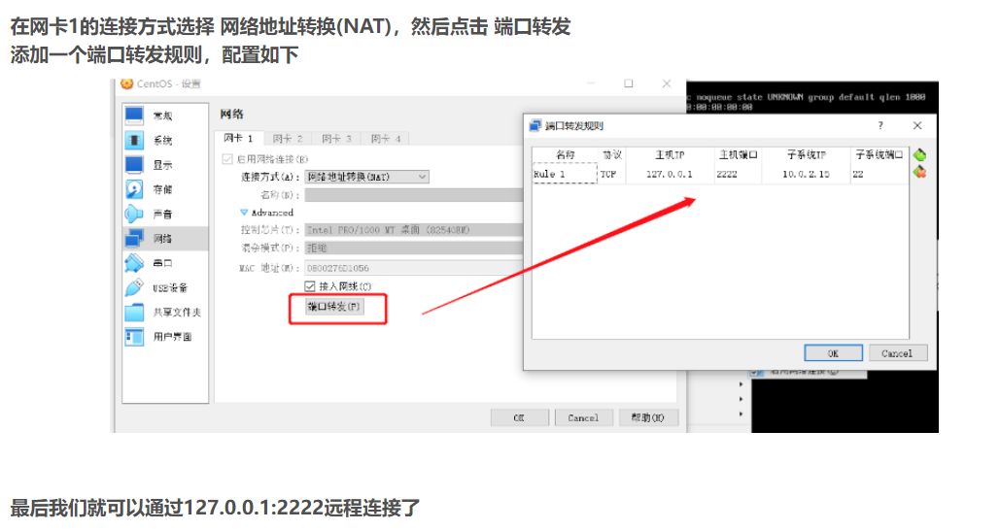
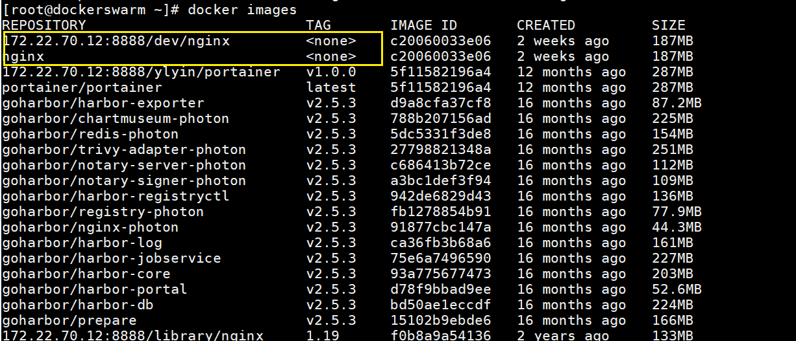

# Centos 7 安装 Docker 步骤（流畅安装版）
https://cloud.tencent.com/developer/article/1701451


这里非常重要一定要先运行这个更新命令（*不然后面安装出错改到你想哭）
```shell
    yum -y update
```

docker




出现一下则安装成功：




# 开启docker 开启自动启动
```shell
systemctl enable docker
```

# 安装docker compose

```shell
# daocloud 下载源
curl -SL https://get.daocloud.io/docker/compose/releases/download/v2.17.2/docker-compose-linux-x86_64 -o /usr/local/bin/docker-compose
# github 下载源
curl -SL https://github.com/docker/compose/releases/download/v2.17.2/docker-compose-linux-x86_64 -o /usr/local/bin/docker-compose

```
将下载后的文件放到 /usr/local/bin 目录下，并添加执行权限
```shell
chmod +x /usr/local/bin/docker-compose
```


# Push 本地Docker镜像到阿里云镜像仓库上


# 1. Hardware assisted virtualization and data execution protection must be enabled in the BIO 

https://docs.docker.com/desktop/troubleshoot/topics/

https://docs.docker.com/desktop/troubleshoot/topics/#virtualization

Hyper-V
1.禁用hyper-v
``` shell
    bcdedit /set hypervisorlaunchtype off 
```
执行完改名了即可运行docker

2.重新启用hyper-v
如需要重新使用hyper-v重新开启即可
``` shell
bcdedit /set hypervisorlaunchtype auto
```

Hypervisor enabled at Windows startup
If you have completed the steps described above and are still experiencing Docker Desktop startup issues, this could be because the Hypervisor is installed, but not launched during Windows startup. Some tools (such as older versions of Virtual Box) and video game installers turn off hypervisor on boot. To turn it back on:

Open an administrative console prompt.

Run  
``` shell 
bcdedit /set hypervisorlaunchtype auto. 
```
Restart Windows.


# 2. VirtualBox不能为虚拟电脑打开一个新任务
使用docker需要上述配置，而virtualbox的镜像任务启动不能hyper-v， 需要在启用或者关闭Windos功能中将Hyper-v关闭


然后在管理员cmd下运行命令：
```shell
    bcdedit /set hypervisorlaunchtype off 
```

# 3. 安装Virtualbox 增强功能报modprobe vboxguest failed解决方法

https://blog.csdn.net/weixin_45848781/article/details/121312926

设置virtualbox copy与paste的问题：



# 4. 打开或者关闭防火墙(换镜像+更新操作都把防火墙关了)
https://blog.csdn.net/qq_35971258/article/details/79318842
```shell
systemctl status firewalld # 查看防火墙状态

service  iptables status

systemctl stop firewalld # 暂时关闭防火墙

service  iptables stop

systemctl disable firewalld # 永久关闭防火墙

chkconfig iptables off

systemctl enable firewalld # 重启防火墙

service iptables restart  

chkconfig iptables on　 # 永久关闭后重启
```

在VirtualBox中解决CentOS虚拟机与主机之间的复制粘贴问题，可以按照以下步骤进行：

1. **安装增强功能：**
   确保你已经在CentOS虚拟机中安装了VirtualBox增强功能。在CentOS虚拟机窗口的顶部菜单栏中，选择“设备”（Devices）>“安装增强功能”（Install Guest Additions）。然后，按照提示执行安装。

2. **更新系统：**
   在CentOS虚拟机中，使用以下命令更新系统：

   ```bash
   sudo yum update
   ```

3. **安装依赖项：**
   确保安装了构建和内核头文件：

   ```bash
   sudo yum install gcc kernel-devel kernel-headers dkms make bzip2 perl
   ```

4. **重新启动虚拟机：**
   安装增强功能后，重新启动CentOS虚拟机，以确保新内核模块已加载。

   ```bash
   sudo reboot
   ```

5. **配置共享剪贴板：**
   在VirtualBox主界面，选择你的虚拟机，然后点击“设置”（Settings）。在设置窗口中，选择“通用”（General），然后在“高级”（Advanced）选项卡下找到“剪贴板共享”（Clipboard Sharing）。选择“双向”（Bidirectional）。

6. **重新启动虚拟机：**
   关闭并重新启动CentOS虚拟机，以应用新的设置。

7. **测试复制粘贴：**
   在CentOS虚拟机中，尝试复制文本并粘贴到主机，以及从主机复制文本并粘贴到虚拟机。确保这些操作都正常工作。

通过执行这些步骤，你应该能够解决VirtualBox中CentOS虚拟机与主机之间的复制粘贴问题。如果问题仍然存在，确保你使用的是最新版本的VirtualBox和CentOS，并检查VirtualBox和Guest Additions的日志文件以获取更多信息。


要更新CentOS和VirtualBox，你可以按照以下步骤进行：

### 更新CentOS：

1. 打开终端（Terminal）。

2. 运行以下命令以更新系统：

   ```bash
   sudo yum update
   ```

   这会安装最新的软件包和安全更新。

3. 如果系统要求，确认是否更新。输入`y`并按Enter。

4. 等待更新完成。

5. 重启系统，以确保所有更改生效：

   ```bash
   sudo reboot
   ```

### 更新VirtualBox：

1. **下载最新版本：**
   访问 [VirtualBox官方网站](https://www.virtualbox.org/) 下载最新版本的VirtualBox。

2. **安装新版本：**
   - 如果你使用RPM包管理系统（如CentOS），可以下载RPM包，然后运行以下命令进行安装：

     ```bash
     sudo yum localinstall <VirtualBox_package_name>.rpm
     ```

   - 如果你使用其他发行版，可以使用适合你系统的软件包管理工具进行安装。

3. **更新VirtualBox增强功能（可选）：**
   如果你更新了VirtualBox并在虚拟机中安装了增强功能，确保你在虚拟机中重新启动，以使新的Guest Additions生效。

4. **重新启动系统：**
   重启你的计算机，确保所有更改都得到应用。

请记住在更新操作系统或虚拟机软件之前备份重要数据，以防发生意外情况。


# 6. 修改yum源为阿里云yum源
https://developer.aliyun.com/article/786782

# 7. 在Virtualbox安装Centos7配置SSH远程连接
https://blog.csdn.net/ls909074489/article/details/128813331?spm=1001.2101.3001.6650.1&utm_medium=distribute.pc_relevant.none-task-blog-2%7Edefault%7EBlogCommendFromBaidu%7ERate-1-128813331-blog-108906642.235%5Ev38%5Epc_relevant_sort_base1&depth_1-utm_source=distribute.pc_relevant.none-task-blog-2%7Edefault%7EBlogCommendFromBaidu%7ERate-1-128813331-blog-108906642.235%5Ev38%5Epc_relevant_sort_base1&utm_relevant_index=2






# 8. Error response from daemon: error while validating Root CA Certificate: x509: certificate has expired or is not yet valid: current time 2023-11-15T00:26:52-05:00 is before 2023-11-15T05:53:00Z
证书问题：因为集群时间不一致。
https://www.cnblogs.com/cuijinlong/p/13094016.html

```shell
# 安装ntpdate
yum -y install ntp ntpdate
# 同步集群时间
ntpdate cn.pool.ntp.org
```

# 9. Docker mysql数据库主从配置：Mysql配置主从报错You must at least set --server-id to enable either a master or a slave

配置文件后缀为.cnf 而不是.conf


# NFS 文件存储服务


# 10. 安装Docker harbor报错：ERROR:root:Error: The protocol is https but attribute ssl_cert is not set
https://blog.csdn.net/zhengzaifeidelushang/article/details/110781033

注释掉harbor.yml中https的配置


# 11. 删除玄虚镜像(image tag 为none的镜像)


执行下面命令：

```shell
docker image prune
```

## Corn String
https://zhuanlan.zhihu.com/p/437328366


## linux中docker报错：ERROR: Got permission denied while trying to connect to the Docker daemon socket。
https://blog.csdn.net/qq_45097352/article/details/116105246

方法1：
```shelsu root
# 进入root进行操作
su root
```

方法2：
```shell
# 将当前用户添加到docker用户组中
sudo groupadd docker               #添加用户组
sudo gpasswd -a username docker    #将当前用户添加至用户组
newgrp docker                      #更新用户组
```

# jenkins运行脚本出现mvn permission denied
`mvn --version
/var/jenkins_home/workspace/smartbup-pipline@tmp/durable-7c61e358/script.sh: line 1: mvn: Permission denied`

解决方法：
```shell
echo $PATH
# 查看mvn地址
> /usr/lib/jvm/java-1.8.0-openjdk-1.8.0.392.b08-2.el7_9.x86_64/bin:/jre/bin:/usr/local/sbin:/usr/local/bin:/usr/sbin:/usr/bin:/usr/local/apache-maven-3.5.4/bin:/root/bin
# 给对应文件添加权限
chmod a+x /usr/local/apache-maven-3.5.4/bin/mvn
```
## Could not connect to Redis at 127.0.0.1:6379: Connection refused
not connected