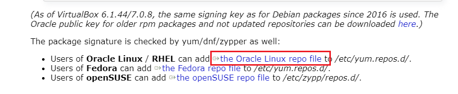

# Vritual Box
## Virtual Box 在centos安装
进入 Virtual box 官网下载
https://www.virtualbox.org/wiki/Linux_Downloads
滑到最下面

点击拷贝

进入cd /etc/yum.repos.d/
```shell
cd /etc/yum.repos.d/
vi virtualbox.repo 
# 将repo file的内容拷贝到里面
[virtualbox]
name=Oracle Linux / RHEL / CentOS-$releasever / $basearch - VirtualBox
baseurl=http://download.virtualbox.org/virtualbox/rpm/el/$releasever/$basearch
enabled=1
gpgcheck=1
repo_gpgcheck=1
gpgkey=https://www.virtualbox.org/download/oracle_vbox_2016.asc
```
然后执行install命令下载安装
```shell
yum -y install VirtualBox-6.1
```